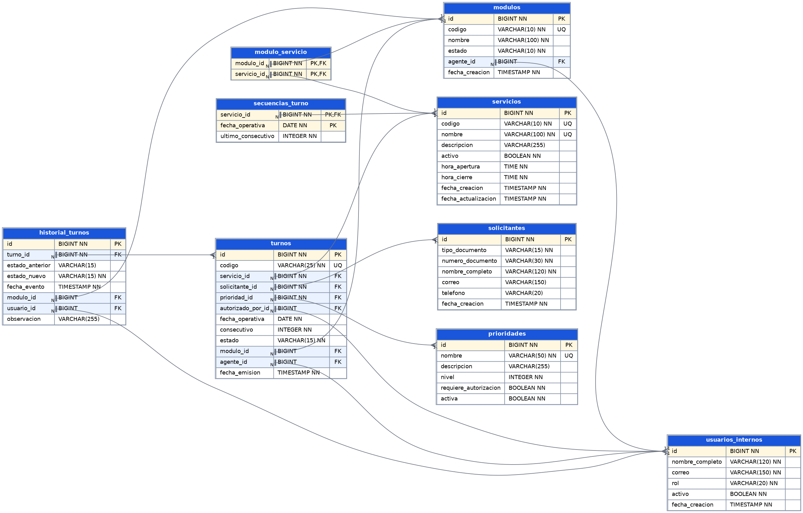

# Modelo relacional — Gestión de turnos y atención al usuario

Generado a partir del esquema real de PostgreSQL (`database/01_esquema.sql`). Convenciones: `PK` clave primaria, `FK` clave foránea, `NN` NOT NULL, `UQ` único.

## Relaciones

| Tabla padre | Tabla hija | Cardinalidad | Significado |
|---|---|---|---|
| servicios | turnos | 1 : N | Cada turno pertenece a un servicio |
| solicitantes | turnos | 1 : N | Un solicitante puede tener varios turnos (solo uno activo por servicio, RN-03) |
| prioridades | turnos | 1 : N | Prioridad aplicada al turno |
| usuarios_internos | turnos | 1 : N | `autorizado_por_id` (prioridad autorizada) y `agente_id` (atiende) |
| modulos | turnos | 1 : N | Módulo que llama/atiende (un solo turno activo, RN-07) |
| turnos | historial_turnos | 1 : N | Cada cambio de estado deja una fila (RN-09, RN-12) |
| modulos / servicios | modulo_servicio | N : M | Servicios habilitados por módulo (RN-06) |
| servicios | secuencias_turno | 1 : N | Un consecutivo por servicio y fecha operativa (RN-01) |
| usuarios_internos | modulos | 1 : N | Agente que tiene el módulo abierto |

## Diccionario de datos

### historial_turnos

| Columna | Tipo | Restricciones |
|---|---|---|
| `id` | BIGINT | PK |
| `turno_id` | BIGINT | NN, FK → turnos |
| `estado_anterior` | VARCHAR(15) |  |
| `estado_nuevo` | VARCHAR(15) | NN |
| `fecha_evento` | TIMESTAMP | NN, DEFAULT CURRENT_TIMESTAMP |
| `modulo_id` | BIGINT | FK → modulos |
| `usuario_id` | BIGINT | FK → usuarios_internos |
| `observacion` | VARCHAR(255) |  |

Restricciones e índices:

- CHECK `ck_historial_estado_anterior`: `(((estado_anterior IS NULL) OR ((estado_anterior)::text = ANY ((ARRAY['EN_ESPERA'::character varying, 'LLAMADO'::character varying, 'EN_ATENCION'::character varying, 'FINALIZADO'::character varying, 'CANCELADO'::character varying, 'NO_PRESENTE'::character varying])::text[]))))`
- CHECK `ck_historial_estado_nuevo`: `(((estado_nuevo)::text = ANY ((ARRAY['EN_ESPERA'::character varying, 'LLAMADO'::character varying, 'EN_ATENCION'::character varying, 'FINALIZADO'::character varying, 'CANCELADO'::character varying, 'NO_PRESENTE'::character varying])::text[])))`
- Índice `ix_historial_turno`
- Índice `ix_historial_estado`

### modulo_servicio

| Columna | Tipo | Restricciones |
|---|---|---|
| `modulo_id` | BIGINT | PK, FK → modulos |
| `servicio_id` | BIGINT | PK, FK → servicios |

Restricciones e índices:

- Índice `ix_modulo_servicio_servicio`

### modulos

| Columna | Tipo | Restricciones |
|---|---|---|
| `id` | BIGINT | PK |
| `codigo` | VARCHAR(10) | NN |
| `nombre` | VARCHAR(100) | NN |
| `estado` | VARCHAR(10) | NN, DEFAULT 'CERRADO' |
| `agente_id` | BIGINT | FK → usuarios_internos |
| `fecha_creacion` | TIMESTAMP | NN, DEFAULT CURRENT_TIMESTAMP |

Restricciones e índices:

- UQ `uq_modulos_codigo` (codigo)
- CHECK `ck_modulos_estado`: `(((estado)::text = ANY ((ARRAY['ABIERTO'::character varying, 'PAUSADO'::character varying, 'CERRADO'::character varying])::text[])))`
- CHECK `ck_modulos_agente`: `((((estado)::text = 'CERRADO'::text) OR (agente_id IS NOT NULL)))`
- Índice `ix_modulos_agente`

### prioridades

| Columna | Tipo | Restricciones |
|---|---|---|
| `id` | BIGINT | PK |
| `nombre` | VARCHAR(50) | NN |
| `descripcion` | VARCHAR(255) |  |
| `nivel` | INTEGER | NN, DEFAULT 0 |
| `requiere_autorizacion` | BOOLEAN | NN, DEFAULT true |
| `activa` | BOOLEAN | NN, DEFAULT true |

Restricciones e índices:

- UQ `uq_prioridades_nombre` (nombre)
- CHECK `ck_prioridades_nivel`: `((nivel >= 0))`

### secuencias_turno

| Columna | Tipo | Restricciones |
|---|---|---|
| `servicio_id` | BIGINT | PK, FK → servicios |
| `fecha_operativa` | DATE | PK |
| `ultimo_consecutivo` | INTEGER | NN, DEFAULT 0 |

Restricciones e índices:

- CHECK `ck_secuencias_consecutivo`: `((ultimo_consecutivo >= 0))`

### servicios

| Columna | Tipo | Restricciones |
|---|---|---|
| `id` | BIGINT | PK |
| `codigo` | VARCHAR(10) | NN |
| `nombre` | VARCHAR(100) | NN |
| `descripcion` | VARCHAR(255) |  |
| `activo` | BOOLEAN | NN, DEFAULT true |
| `hora_apertura` | TIME | NN |
| `hora_cierre` | TIME | NN |
| `fecha_creacion` | TIMESTAMP | NN, DEFAULT CURRENT_TIMESTAMP |
| `fecha_actualizacion` | TIMESTAMP | NN, DEFAULT CURRENT_TIMESTAMP |

Restricciones e índices:

- UQ `uq_servicios_codigo` (codigo)
- UQ `uq_servicios_nombre` (nombre)
- CHECK `ck_servicios_codigo_formato`: `(((codigo)::text ~ '^[A-Z]{2,10}$'::text))`
- CHECK `ck_servicios_horario`: `((hora_cierre > hora_apertura))`

### solicitantes

| Columna | Tipo | Restricciones |
|---|---|---|
| `id` | BIGINT | PK |
| `tipo_documento` | VARCHAR(15) | NN |
| `numero_documento` | VARCHAR(30) | NN |
| `nombre_completo` | VARCHAR(120) | NN |
| `correo` | VARCHAR(150) |  |
| `telefono` | VARCHAR(20) |  |
| `fecha_creacion` | TIMESTAMP | NN, DEFAULT CURRENT_TIMESTAMP |

Restricciones e índices:

- UQ `uq_solicitantes_documento` (tipo_documento,numero_documento)
- CHECK `ck_solicitantes_tipo_documento`: `(((tipo_documento)::text = ANY ((ARRAY['CC'::character varying, 'TI'::character varying, 'CE'::character varying, 'PASAPORTE'::character varying])::text[])))`

### turnos

| Columna | Tipo | Restricciones |
|---|---|---|
| `id` | BIGINT | PK |
| `codigo` | VARCHAR(25) | NN |
| `servicio_id` | BIGINT | NN, FK → servicios |
| `solicitante_id` | BIGINT | NN, FK → solicitantes |
| `prioridad_id` | BIGINT | NN, FK → prioridades |
| `autorizado_por_id` | BIGINT | FK → usuarios_internos |
| `fecha_operativa` | DATE | NN |
| `consecutivo` | INTEGER | NN |
| `estado` | VARCHAR(15) | NN, DEFAULT 'EN_ESPERA' |
| `modulo_id` | BIGINT | FK → modulos |
| `agente_id` | BIGINT | FK → usuarios_internos |
| `fecha_emision` | TIMESTAMP | NN, DEFAULT CURRENT_TIMESTAMP |

Restricciones e índices:

- UQ `uq_turnos_codigo` (codigo)
- UQ `uq_turnos_secuencia` (servicio_id,fecha_operativa,consecutivo)
- CHECK `ck_turnos_consecutivo`: `((consecutivo > 0))`
- CHECK `ck_turnos_estado`: `(((estado)::text = ANY ((ARRAY['EN_ESPERA'::character varying, 'LLAMADO'::character varying, 'EN_ATENCION'::character varying, 'FINALIZADO'::character varying, 'CANCELADO'::character varying, 'NO_PRESENTE'::character varying])::text[])))`
- CHECK `ck_turnos_asignacion`: `((((estado)::text <> ALL ((ARRAY['LLAMADO'::character varying, 'EN_ATENCION'::character varying])::text[])) OR ((modulo_id IS NOT NULL) AND (agente_id IS NOT NULL))))`
- UQ Índice `uq_turnos_activo_solicitante_servicio` parcial: `estado)::text = ANY ((ARRAY['EN_ESPERA'::character varying, 'LLAMADO'::character varying, 'EN_ATENCION'::character varying])::text[]`
- UQ Índice `uq_turnos_activo_modulo` parcial: `estado)::text = ANY ((ARRAY['LLAMADO'::character varying, 'EN_ATENCION'::character varying])::text[]`
- Índice `ix_turnos_fila` parcial: `estado)::text = 'EN_ESPERA'::text`
- Índice `ix_turnos_solicitante`
- Índice `ix_turnos_prioridad`
- Índice `ix_turnos_fecha_estado`

### usuarios_internos

| Columna | Tipo | Restricciones |
|---|---|---|
| `id` | BIGINT | PK |
| `nombre_completo` | VARCHAR(120) | NN |
| `correo` | VARCHAR(150) | NN |
| `rol` | VARCHAR(20) | NN |
| `activo` | BOOLEAN | NN, DEFAULT true |
| `fecha_creacion` | TIMESTAMP | NN, DEFAULT CURRENT_TIMESTAMP |

Restricciones e índices:

- CHECK `ck_usuarios_internos_rol`: `(((rol)::text = ANY ((ARRAY['AGENTE'::character varying, 'COORDINADOR'::character varying, 'ADMINISTRADOR'::character varying])::text[])))`
- UQ Índice `uq_usuarios_internos_correo`

### v_turnos_tiempos (vista, RN-12)

Calcula `tiempo_espera` (emisión → llamado) y `tiempo_atencion` (inicio → fin) desde `historial_turnos`; los tiempos no se editan directamente.
